=== FILENAME: userflow.md ===

# User Flow Document
## KeySpace Mobile Application

| Atribut | Nilai |
|---|---|
| Nama produk | KeySpace |
| Platform | Android dan iOS |
| Arsitektur | Offline-first, local-only, tanpa login |
| Strategi API key | Sticky Sequential Failover |
| Versi dokumen | 1.0 |
| Tanggal baseline | 21 Juli 2026 |

---

## 1. Tujuan Dokumen

Dokumen ini menjelaskan alur pengguna KeySpace dari instalasi pertama sampai penggunaan rutin. Alur mencakup happy path, offline path, error path, pengelolaan API Key Pool, koreksi hasil AI, dashboard, reminder, dan pengelolaan data.

Prinsip utama seluruh flow:

1. Tidak ada login.
2. Pengguna dapat masuk aplikasi tanpa internet.
3. Input chat tidak hilang saat API gagal.
4. Satu key gagal menyebabkan sistem mencoba key berikutnya secara otomatis.
5. Seluruh key gagal menyebabkan peringatan dan primary action **Tambah API Key Baru**.
6. Pengguna selalu memiliki jalur **Catat Manual**.
7. Hasil AI adalah estimasi dan dapat diedit.
8. API key ditampilkan masked dan disimpan di secure storage.
9. Data lokal adalah sumber kebenaran.

---

## 2. Terminologi Status UI

### 2.1 Status Food Parsing

| Status | Makna | Tampilan Pengguna |
|---|---|---|
| `idle` | Belum ada request aktif | Composer dapat digunakan. |
| `drafting` | Pengguna mengetik | Draft disimpan lokal. |
| `validating_input` | Input sedang divalidasi | Transisi singkat. |
| `requesting` | Request Gemini aktif | Loading dan tombol batal. |
| `failing_over` | Key saat ini gagal dan key berikutnya dicoba | “Mencoba koneksi alternatif…” |
| `preview_ready` | Hasil terstruktur tersedia | Preview editable. |
| `saving` | Draft disimpan sebagai log | Progress singkat. |
| `complete` | Log berhasil tersimpan | Confirmation dan link ke dashboard. |
| `offline` | Tidak ada koneksi | Retry/manual entry. |
| `all_keys_failed` | Tidak ada key berhasil | Tambah key/manage/retry/manual. |
| `request_error` | Payload/provider response tidak dapat diproses | Ubah input/retry/manual. |
| `cancelled` | Dibatalkan pengguna | Draft tetap tersedia. |

### 2.2 Status API Key

| Status | Makna | Eligible untuk Auto-use |
|---|---|---|
| `untested` | Belum diuji | Ya, jika enabled. |
| `healthy` | Request terakhir berhasil | Ya. |
| `limited` | Rate limit/quota; menunggu cooldown | Tidak sebelum cooldown berakhir. |
| `invalid` | Key tidak valid | Tidak. |
| `blocked` | Project/key tidak memiliki akses | Tidak sampai diuji ulang/diubah. |
| `transient_error` | Gangguan sementara | Tidak sebelum cooldown singkat berakhir. |
| `secret_unavailable` | Secret tidak dapat dibaca | Tidak. |
| `disabled` | Dinonaktifkan pengguna | Tidak. |

---

## 3. Struktur Navigasi

```text
App Launch
├── Onboarding, jika belum selesai
└── Main App
    ├── Hari Ini
    │   ├── Detail tanggal
    │   ├── Add food
    │   └── Edit Food Log
    ├── Chat
    │   ├── Input
    │   ├── Preview AI
    │   ├── Edit
    │   └── Histori chat lokal
    ├── Riwayat
    │   ├── Harian
    │   ├── Mingguan
    │   └── Bulanan
    ├── Insight
    │   ├── Kalori
    │   └── Makro
    └── Pengaturan
        ├── Target dan profil
        ├── API Key Pool
        ├── Reminder
        ├── Theme dan satuan
        ├── Data, export, backup, restore
        ├── Privasi
        ├── App Lock (PIN/Biometric)
        └── Diagnostics lokal

Home Screen Perangkat (Fase 3)
└── Widget KeySpace
    ├── Ringkasan kalori hari ini
    └── Quick Add -> membuka Chat/Manual Entry
```

---

## 4. Flow A — App Launch dan Routing Awal

### 4.1 Step-by-Step

1. Pengguna membuka KeySpace.
2. Aplikasi melakukan bootstrap lokal:
   - membuka database;
   - membaca status onboarding;
   - menginisialisasi secure storage adapter;
   - memeriksa pending draft;
   - merekonsiliasi reminder;
   - tidak memanggil Gemini.
3. Jika database tidak dapat dibuka:
   - tampilkan Recovery Screen;
   - actions: Coba Lagi, Restore Backup, Lihat Diagnostics;
   - reset data hanya tersedia setelah konfirmasi.
4. Jika onboarding belum selesai:
   - buka Flow B.
5. Jika onboarding selesai dan App Lock **tidak aktif**:
   - buka Dashboard Hari Ini.
5a. Jika onboarding selesai dan App Lock **aktif**:
   - tampilkan Layar Lock (biometrik dengan fallback PIN, atau PIN saja jika biometrik tidak diaktifkan);
   - konten Dashboard tidak dirender di belakang Layar Lock;
   - setelah autentikasi berhasil, lanjut ke Dashboard Hari Ini;
   - App Lock yang sama juga dipicu setiap kali aplikasi resume dari background sesuai mode yang dipilih pengguna (selalu, atau setelah idle timeout).
6. Jika terdapat draft chat yang belum selesai:
   - tampilkan banner “Ada pencatatan yang belum selesai”;
   - actions: Lanjutkan atau Hapus Draft.
7. Jika seluruh key terakhir berstatus tidak tersedia:
   - jangan memblokir Home;
   - tampilkan banner nonmodal di Home/Chat: “AI belum tersedia. Tambahkan atau periksa API key.”

### 4.2 Mermaid

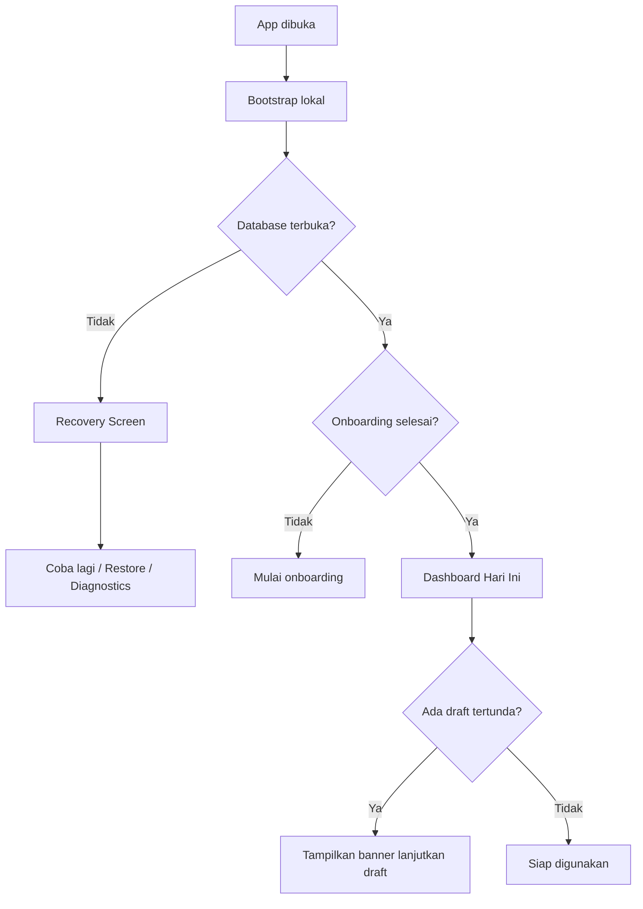
```mermaid
flowchart TD
    A[App dibuka] --> B[Bootstrap lokal]
    B --> C{Database terbuka?}
    C -- Tidak --> D[Recovery Screen]
    D --> E[Coba lagi / Restore / Diagnostics]
    C -- Ya --> F{Onboarding selesai?}
    F -- Tidak --> G[Mulai onboarding]
    F -- Ya --> H[Dashboard Hari Ini]
    H --> I{Ada draft tertunda?}
    I -- Ya --> J[Tampilkan banner lanjutkan draft]
    I -- Tidak --> K[Siap digunakan]
```

---

## 5. Flow B — Onboarding Awal

### 5.1 Tujuan

Membawa pengguna ke aplikasi tanpa login dengan konfigurasi minimum yang cukup, sambil memberi opsi kalkulasi target dan setup API key.

### 5.2 Layar dan Langkah

#### B1 — Welcome

Konten:

- “Catat makanan cukup lewat chat.”
- “Data disimpan di perangkat.”
- “Tidak perlu login.”
- “Teks makanan hanya dikirim ke Gemini ketika fitur AI digunakan.”

Action:

- Primary: **Mulai**
- Secondary: **Pelajari Privasi**

#### B2 — Preferensi Dasar

Input:

- nama panggilan opsional;
- satuan berat;
- satuan tinggi;
- theme mengikuti sistem secara default.

Action:

- **Lanjut**

Validasi dilakukan lokal.

#### B3 — Pilih Cara Menentukan Target

Options:

1. **Masukkan target manual**
2. **Bantu hitung estimasi**
3. **Atur nanti**

Rekomendasi UX: target manual menjadi jalur tercepat, kalkulator ditawarkan sebagai bantuan.

#### B4A — Target Manual

1. Pengguna memasukkan kcal/hari.
2. Aplikasi memvalidasi angka.
3. Jika nilai ekstrem:
   - tampilkan konfirmasi netral;
   - pengguna dapat kembali atau tetap menyimpan.
4. Simpan sebagai target dengan source `manual`.

#### B4B — Kalkulator BMR/TDEE Opsional

1. Pengguna mengisi berat, tinggi, usia, kategori formula, aktivitas, dan goal.
2. Aplikasi menghitung BMR/TDEE lokal.
3. Tampilkan:
   - hasil estimasi;
   - formula;
   - activity factor;
   - penyesuaian goal;
   - disclaimer.
4. Pengguna dapat:
   - Terapkan;
   - Ubah hasil manual;
   - Kembali.
5. Nilai yang diterapkan disimpan sebagai target source `tdee`.

#### B5 — Setup API Key

Konten menjelaskan:

- Key berasal dari akun/project pengguna sendiri.
- Key disimpan aman pada perangkat.
- Key diperlukan hanya untuk chatbot AI.
- Pengguna dapat menambahkan lebih banyak key nanti.
- Key dari project yang sama mungkin berbagi quota.

Actions:

- Primary: **Tambah API Key**
- Secondary: **Lewati untuk Sekarang**

#### B6A — Tambah Key Pertama

1. Pengguna paste/ketik API key.
2. Opsional memberi alias.
3. Toggle **Tes key sekarang** default aktif.
4. Pengguna menekan **Simpan dan Tes**.
5. Secret ditulis ke secure storage.
6. Metadata ditulis ke database.
7. Request validasi ringan dilakukan.

Kemungkinan hasil:

- Berhasil → status `healthy`; tampilkan “API key siap digunakan.”
- Rate limit → status `limited`; key tersimpan; tawarkan tambah key lain.
- Invalid → status `invalid`; tampilkan Edit/Hapus/Simpan sebagai invalid.
- Offline → status `untested`; key tetap tersimpan.
- Server error → status `transient_error`; tawarkan tes ulang nanti.

#### B6B — Lewati

1. Onboarding tetap dapat selesai.
2. Dashboard tersedia.
3. Chat menampilkan gate kontekstual saat dibuka:
   - Tambah API Key;
   - Catat Manual.

#### B7 — Reminder Opsional

1. Jelaskan reminder lokal.
2. Pengguna memilih:
   - Aktifkan;
   - Nanti.
3. Jika aktif:
   - pilih jam;
   - pilih threshold;
   - aplikasi meminta permission OS;
   - jika denied, onboarding tetap lanjut.

#### B8 — Selesai

1. Aplikasi menyimpan onboarding sebagai selesai.
2. Buka Dashboard Hari Ini.
3. Tampilkan coach mark:
   - “Tekan Catat Makanan untuk mulai.”

### 5.3 Mermaid

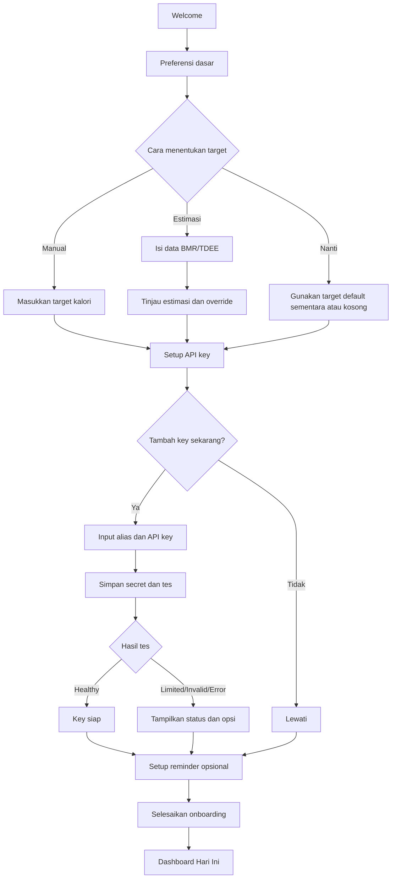
```mermaid
flowchart TD
    A[Welcome] --> B[Preferensi dasar]
    B --> C{Cara menentukan target}
    C -- Manual --> D[Masukkan target kalori]
    C -- Estimasi --> E[Isi data BMR/TDEE]
    C -- Nanti --> F[Gunakan target default sementara atau kosong]
    E --> G[Tinjau estimasi dan override]
    D --> H[Setup API key]
    G --> H
    F --> H
    H --> I{Tambah key sekarang?}
    I -- Ya --> J[Input alias dan API key]
    J --> K[Simpan secret dan tes]
    K --> L{Hasil tes}
    L -- Healthy --> M[Key siap]
    L -- Limited/Invalid/Error --> N[Tampilkan status dan opsi]
    I -- Tidak --> O[Lewati]
    M --> P[Setup reminder opsional]
    N --> P
    O --> P
    P --> Q[Selesaikan onboarding]
    Q --> R[Dashboard Hari Ini]
```

---

## 6. Flow C — Mencatat Makanan via Chatbot

### 6.1 Entry Points

Pengguna dapat masuk dari:

- tab Chat;
- tombol **Catat Makanan** di Dashboard;
- empty state;
- notifikasi reminder;
- banner draft tertunda;
- quick action platform jika ditambahkan.

### 6.2 Happy Path Step-by-Step

1. Pengguna membuka Chat.
2. Aplikasi menampilkan sesi hari ini atau membuat sesi baru.
3. Pengguna mengetik, misalnya:
   - “Aku makan nasi goreng sama es teh.”
4. Draft disimpan lokal secara periodik/on-change.
5. Pengguna dapat mengatur:
   - tanggal/waktu;
   - meal type.
6. Pengguna menekan **Kirim**.
7. Aplikasi memvalidasi:
   - tidak kosong;
   - panjang masih dalam batas;
   - minimal satu key tersedia;
   - jaringan dapat dicoba.
8. Pesan user disimpan sebagai `pending`.
9. `GeminiFailoverService` memilih Active Key.
10. UI menampilkan state `requesting` dan tombol Batal.
11. Gemini mengembalikan structured JSON.
12. Aplikasi:
   - memvalidasi schema;
   - menormalisasi angka;
   - menghitung ulang total;
   - membuat Food Log berstatus `draft`;
   - menyimpan assistant message lokal.
13. UI membuka Preview.
14. Pengguna meninjau item.
15. Pengguna memilih:
   - Simpan;
   - Edit;
   - Proses Ulang;
   - Hapus Item;
   - Batal.
16. Jika Simpan:
   - transaksi menyimpan/menegaskan Food Log;
   - dashboard di-refresh;
   - reminder direkonsiliasi.
17. Tampilkan success state:
   - “640 kcal ditambahkan ke hari ini.”
18. Actions:
   - Lihat Dashboard;
   - Tambah Lagi.

### 6.3 Mermaid Happy Path

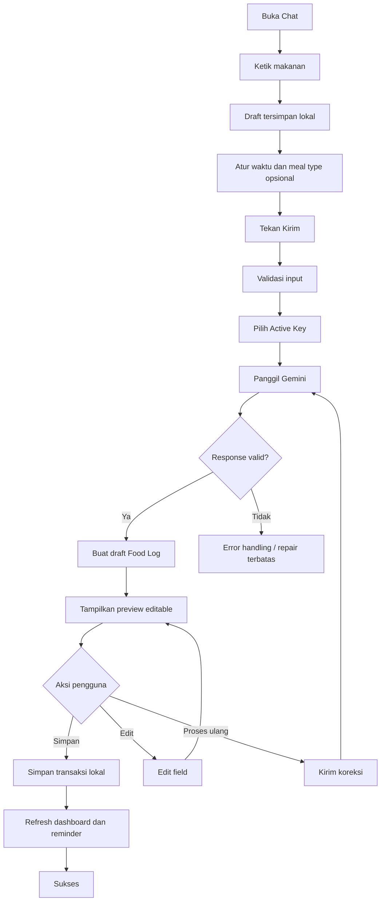
```mermaid
flowchart TD
    A[Buka Chat] --> B[Ketik makanan]
    B --> C[Draft tersimpan lokal]
    C --> D[Atur waktu dan meal type opsional]
    D --> E[Tekan Kirim]
    E --> F[Validasi input]
    F --> G[Pilih Active Key]
    G --> H[Panggil Gemini]
    H --> I{Response valid?}
    I -- Ya --> J[Buat draft Food Log]
    J --> K[Tampilkan preview editable]
    K --> L{Aksi pengguna}
    L -- Simpan --> M[Simpan transaksi lokal]
    M --> N[Refresh dashboard dan reminder]
    N --> O[Sukses]
    L -- Edit --> P[Edit field]
    P --> K
    L -- Proses ulang --> Q[Kirim koreksi]
    Q --> H
    I -- Tidak --> R[Error handling / repair terbatas]
```

### 6.4 Tanpa API Key

1. Pengguna membuka Chat.
2. Sistem mendeteksi tidak ada key enabled.
3. Tampilkan empty/gate state:
   - “Tambahkan API key Gemini untuk mencatat lewat AI.”
4. Actions:
   - Primary: Tambah API Key;
   - Secondary: Catat Manual;
   - Link: Mengapa KeySpace memerlukan key?
5. Setelah key ditambahkan:
   - kembali ke Chat;
   - draft tetap ada;
   - pengguna menekan **Lanjutkan**.

### 6.5 Offline

1. Pengguna menekan Kirim.
2. Network call gagal karena offline.
3. Sistem tidak mencoba setiap key.
4. Pesan disimpan `failed` dengan kategori offline.
5. UI:
   - “Tidak ada koneksi internet. Input kamu tetap tersimpan.”
6. Actions:
   - Coba Lagi;
   - Catat Manual;
   - Simpan sebagai Draft.
7. Dashboard dan history tetap dapat digunakan.

### 6.6 User Membatalkan Request

1. Pengguna menekan Batal.
2. HTTP request dibatalkan bila didukung.
3. Tidak ada Food Log final dibuat.
4. Pesan dan draft input tetap ada.
5. UI kembali ke composer dengan label “Dibatalkan.”

---

## 7. Flow D — Koreksi dan Edit Hasil AI

### 7.1 Koreksi Sebelum Simpan

1. Preview menampilkan item cards.
2. Pengguna menekan item.
3. Form edit menampilkan:
   - nama;
   - jumlah;
   - satuan/porsi;
   - kalori;
   - protein;
   - karbohidrat;
   - lemak;
   - catatan.
4. Pengguna mengubah nilai.
5. Validasi lokal:
   - tidak negatif;
   - numeric format;
   - nilai ekstrem memunculkan warning.
6. Tekan **Terapkan**.
7. Total dihitung ulang.
8. Item diberi indikator “Diedit”.
9. Pengguna menekan Simpan.
10. Food Log tersimpan confirmed.

### 7.2 Menghapus Item dari Preview

1. Swipe/menu item.
2. Pilih Hapus.
3. Tampilkan undo snackbar.
4. Total dihitung ulang.
5. Jika semua item dihapus:
   - tombol Simpan dinonaktifkan;
   - tawarkan tambah item manual atau batal.

### 7.3 Proses Ulang dengan Koreksi Natural Language

1. Pengguna memilih **Koreksi lewat Chat**.
2. Composer memuat konteks, misalnya:
   - “Nasiku hanya setengah porsi dan tehnya tanpa gula.”
3. Pengguna mengirim.
4. Sistem menggunakan failover flow yang sama.
5. Hasil baru tampil sebagai perbandingan:
   - Replace draft;
   - Review per item;
   - Batal.
6. Data lama tidak ditimpa sampai dikonfirmasi.

### 7.4 Edit Setelah Tersimpan

Entry points:

- Food Log pada Dashboard;
- detail History;
- referensi dari Chat.

Langkah:

1. Buka detail Food Log.
2. Tekan Edit.
3. Ubah item/tanggal/meal type.
4. Tekan Simpan.
5. Transaksi memperbarui log.
6. Total tanggal lama dan baru dihitung ulang jika tanggal berpindah.
7. Reminder kedua tanggal direkonsiliasi bila diperlukan.
8. Tampilkan “Perubahan disimpan.”

### 7.5 Mermaid

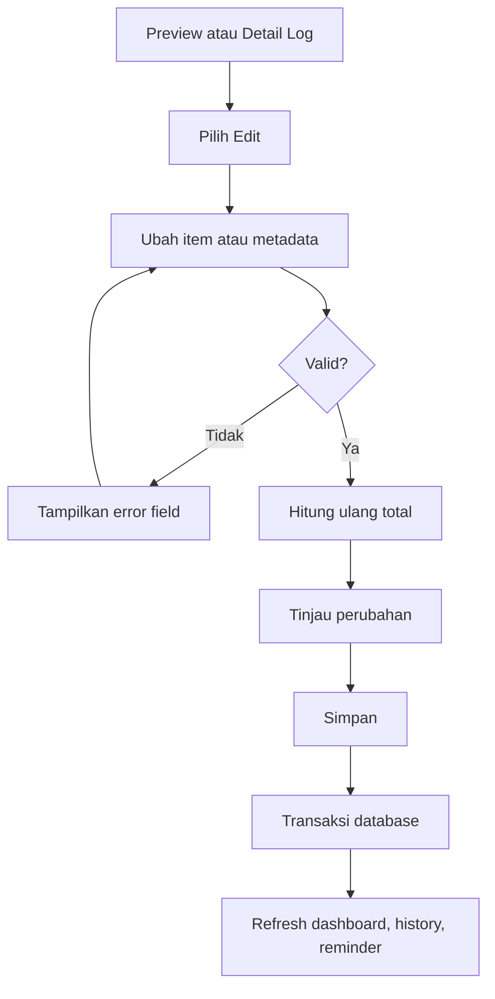
```mermaid
flowchart TD
    A[Preview atau Detail Log] --> B[Pilih Edit]
    B --> C[Ubah item atau metadata]
    C --> D{Valid?}
    D -- Tidak --> E[Tampilkan error field]
    E --> C
    D -- Ya --> F[Hitung ulang total]
    F --> G[Tinjau perubahan]
    G --> H[Simpan]
    H --> I[Transaksi database]
    I --> J[Refresh dashboard, history, reminder]
```

---

## 8. Flow E — Pengelolaan API Key Pool

### 8.1 Membuka Halaman Pool

Path:

`Pengaturan > API Key Pool`

Header menampilkan:

- Active Key;
- jumlah key healthy;
- jumlah limited/invalid;
- CTA Tambah Key;
- info singkat strategi failover.

List item menampilkan:

- alias;
- masked suffix;
- status badge;
- priority number;
- last success/failure;
- cooldown;
- toggle enabled;
- drag handle;
- overflow menu.

### 8.2 Menambah API Key

1. Tekan **Tambah API Key**.
2. Form:
   - alias;
   - API key;
   - toggle tes sekarang.
3. API key field:
   - obscured;
   - tombol show sementara;
   - paste didukung;
   - tidak disimpan dalam form persistence biasa.
4. Tekan Simpan.
5. Tulis secret ke secure storage.
6. Simpan metadata dengan priority terakhir.
7. Jika tes aktif:
   - lakukan request validasi.
8. Tampilkan hasil.
9. Jika request awal sebelumnya gagal karena semua key:
   - tampilkan CTA **Lanjutkan Pencatatan**;
   - kembali ke draft chat;
   - request menggunakan key yang baru/eligible.

### 8.3 Mengubah Urutan/Priority

1. Pengguna long-press drag handle.
2. Pindahkan key.
3. Database memperbarui priority secara transaksi.
4. Jika Active Key masih enabled/eligible:
   - tetap aktif sampai gagal.
5. Pengguna dapat memilih menu **Jadikan Key Aktif Sekarang** untuk override langsung.
6. Request berikutnya mengikuti Active Key baru.

### 8.4 Menonaktifkan Key

1. Toggle enabled off.
2. Jika bukan Active Key:
   - status menjadi disabled untuk selection.
3. Jika Active Key:
   - konfirmasi singkat;
   - sistem memilih key eligible berikutnya.
4. Secret tetap tersimpan.

### 8.5 Menghapus Key

1. Overflow > Hapus.
2. Dialog menjelaskan:
   - metadata dan secret lokal akan dihapus;
   - tidak menghapus key pada Google AI Studio.
3. Pengguna mengonfirmasi.
4. Delete secret.
5. Delete metadata/usage events sesuai policy.
6. Reindex priority.
7. Jika pool menjadi kosong:
   - tampilkan empty state;
   - Chat menampilkan add-key gate.

### 8.6 Tes Ulang Key

1. Pilih key.
2. Tekan **Tes Key**.
3. Jika offline:
   - tampilkan offline; status lama tidak diubah menjadi invalid.
4. Jika success:
   - `healthy`.
5. Jika 429:
   - `limited` dan cooldown.
6. Jika invalid/access denied:
   - `invalid`/`blocked`.
7. Tampilkan detail tanpa raw sensitive error.

### 8.7 Mermaid

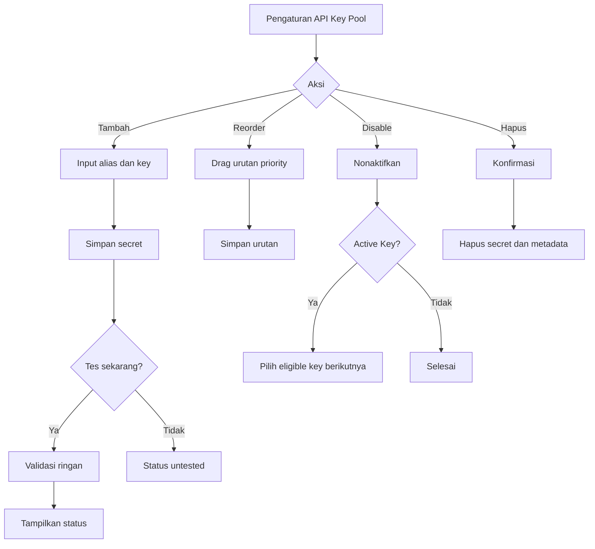
```mermaid
flowchart TD
    A[Pengaturan API Key Pool] --> B{Aksi}
    B -- Tambah --> C[Input alias dan key]
    C --> D[Simpan secret]
    D --> E{Tes sekarang?}
    E -- Ya --> F[Validasi ringan]
    F --> G[Tampilkan status]
    E -- Tidak --> H[Status untested]
    B -- Reorder --> I[Drag urutan priority]
    I --> J[Simpan urutan]
    B -- Disable --> K[Nonaktifkan]
    K --> L{Active Key?}
    L -- Ya --> M[Pilih eligible key berikutnya]
    L -- Tidak --> N[Selesai]
    B -- Hapus --> O[Konfirmasi]
    O --> P[Hapus secret dan metadata]
```

---

## 9. Flow F — Automatic Failover dari Perspektif Pengguna

### 9.1 Prinsip UX

- Failover otomatis; pengguna tidak perlu memilih key saat mencatat.
- UI tidak menampilkan secret atau error teknis mentah.
- Pergantian satu key tidak memunculkan modal yang mengganggu.
- UI dapat menampilkan status ringan bila proses lebih lama:
  - “Mencoba koneksi alternatif…”
- Setelah berhasil, hasil tampil normal.
- Detail kegagalan tersedia di API Key Pool, bukan memenuhi layar Chat.

### 9.2 Failover Sukses

1. User mengirim input.
2. Active Key A dipanggil.
3. Key A menghasilkan error key-specific.
4. Sistem:
   - mengklasifikasi error;
   - memperbarui status Key A;
   - menyimpan usage event;
   - memilih Key B.
5. UI beralih dari “Menganalisis makanan…” ke “Mencoba koneksi alternatif…”.
6. Key B berhasil.
7. Key B menjadi Active Key.
8. Preview tampil.
9. Optional toast ringan:
   - “Berhasil menggunakan key alternatif.”
10. User dapat menyimpan seperti biasa.

### 9.3 Failover dengan Beberapa Key

Contoh pool:

```text
Priority 1 — Key A — Active
Priority 2 — Key B
Priority 3 — Key C
Priority 4 — Key D
```

Skenario:

- A → 429 → status limited/cooldown.
- B → invalid → status invalid.
- C → timeout → retry sekali → gagal → transient cooldown.
- D → success → menjadi Active Key.

Request berikutnya dimulai dari D selama masih eligible.

### 9.4 Error yang Tidak Memicu Rotasi Pool

#### Offline

- Stop segera.
- Jangan menandai semua key gagal.
- Tampilkan offline state.

#### Invalid Request/Schema

- Stop.
- Input tetap ada.
- Tampilkan “Permintaan tidak dapat diproses.”
- Actions: Coba Lagi, Ubah Input, Catat Manual.

#### Safety/Content Block

- Stop.
- Jangan menyatakan key invalid.
- Tawarkan ubah kalimat atau manual entry.

### 9.5 All-Keys-Failed

1. Sistem telah mencoba seluruh key eligible pada satu siklus.
2. Tidak ada hasil sukses.
3. State chat berubah menjadi `all_keys_failed`.
4. Input user dan timestamp tetap ada.
5. Tampilkan bottom sheet/modal:

**Title**

> Semua API key tidak dapat digunakan

**Body**

> Key yang tersedia mungkin mencapai limit, tidak valid, atau sedang mengalami gangguan. Input kamu tetap tersimpan.

**Actions**

1. **Tambah API Key Baru** — primary.
2. **Kelola API Key**.
3. **Coba Lagi**.
4. **Catat Manual**.

6. Jika user memilih Tambah API Key:
   - buka Add Key sebagai nested flow;
   - setelah selesai, kembali ke draft.
7. Jika key baru healthy/untested-enabled:
   - tampilkan **Lanjutkan Pencatatan**.
8. Sistem menjalankan request dari input yang sama.
9. Jika user memilih Catat Manual:
   - buka form manual;
   - prefill original text sebagai notes;
   - tanggal dan meal type dipertahankan.

### 9.6 Mermaid Failover Lengkap

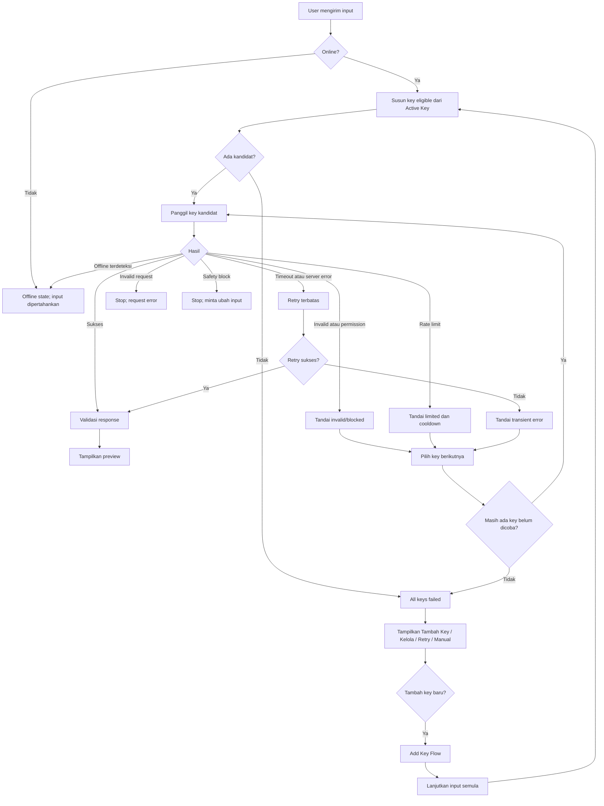
```mermaid
flowchart TD
    A[User mengirim input] --> B{Online?}
    B -- Tidak --> C[Offline state; input dipertahankan]
    B -- Ya --> D[Susun key eligible dari Active Key]
    D --> E{Ada kandidat?}
    E -- Tidak --> Z[All keys failed]
    E -- Ya --> F[Panggil key kandidat]
    F --> G{Hasil}
    G -- Sukses --> H[Validasi response]
    H --> I[Tampilkan preview]
    G -- Invalid atau permission --> J[Tandai invalid/blocked]
    J --> K[Pilih key berikutnya]
    G -- Rate limit --> L[Tandai limited dan cooldown]
    L --> K
    G -- Timeout atau server error --> M[Retry terbatas]
    M --> N{Retry sukses?}
    N -- Ya --> H
    N -- Tidak --> O[Tandai transient error]
    O --> K
    G -- Invalid request --> P[Stop; request error]
    G -- Safety block --> Q[Stop; minta ubah input]
    G -- Offline terdeteksi --> C
    K --> R{Masih ada key belum dicoba?}
    R -- Ya --> F
    R -- Tidak --> Z
    Z --> S[Tampilkan Tambah Key / Kelola / Retry / Manual]
    S --> T{Tambah key baru?}
    T -- Ya --> U[Add Key Flow]
    U --> V[Lanjutkan input semula]
    V --> D
```

---

## 10. Flow G — Dashboard Hari Ini

### 10.1 Entry

Dashboard adalah layar default setelah onboarding.

### 10.2 Komponen

1. Header tanggal.
2. Progress ring/bar:
   - dikonsumsi;
   - target;
   - sisa atau lebih.
3. Macro cards:
   - protein;
   - karbohidrat;
   - lemak.
4. Quick actions:
   - Chat;
   - Manual;
   - Quick Add.
5. Food Log list berdasarkan waktu/meal type.
6. Banner API health hanya jika perlu.
7. Reminder status singkat opsional.

### 10.3 Flow

1. Dashboard membaca agregasi lokal reaktif.
2. Jika belum ada log:
   - empty state “Belum ada makanan dicatat hari ini.”
   - CTA Catat Makanan.
3. Jika ada log:
   - tampilkan total dan list.
4. User dapat:
   - tap progress untuk detail;
   - tap Food Log untuk detail/edit;
   - swipe delete dengan undo;
   - pindah tanggal;
   - quick add.
5. Setelah setiap perubahan:
   - query reaktif memperbarui total;
   - reminder direkonsiliasi.

### 10.4 Pindah Tanggal

1. Tekan header tanggal/calendar.
2. Pilih tanggal.
3. Dashboard memuat target efektif untuk tanggal tersebut.
4. Tampilkan log tanggal tersebut.
5. Jika tanggal historis:
   - CTA tetap memungkinkan tambah log ke tanggal itu;
   - reminder tidak dijadwalkan untuk masa lalu.

### 10.5 Mermaid

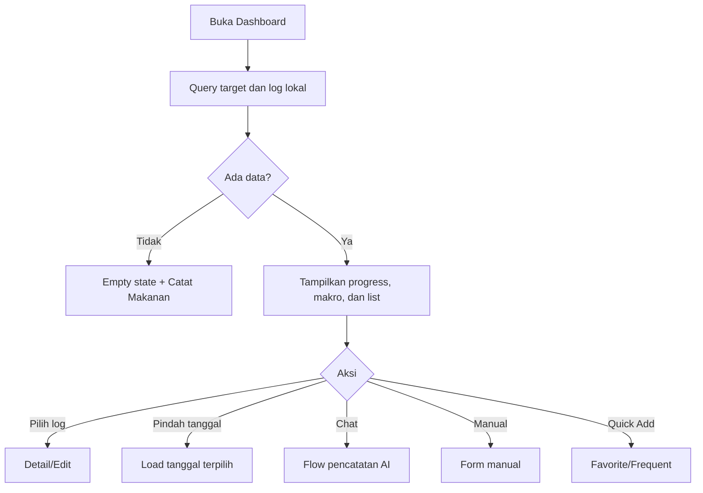
```mermaid
flowchart TD
    A[Buka Dashboard] --> B[Query target dan log lokal]
    B --> C{Ada data?}
    C -- Tidak --> D[Empty state + Catat Makanan]
    C -- Ya --> E[Tampilkan progress, makro, dan list]
    E --> F{Aksi}
    F -- Pilih log --> G[Detail/Edit]
    F -- Pindah tanggal --> H[Load tanggal terpilih]
    F -- Chat --> I[Flow pencatatan AI]
    F -- Manual --> J[Form manual]
    F -- Quick Add --> K[Favorite/Frequent]
```

---

## 11. Flow H — Riwayat Harian, Mingguan, dan Bulanan

### 11.1 Harian

1. Pengguna membuka tab Riwayat.
2. Default menampilkan daftar hari terbaru atau kalender.
3. Setiap hari menampilkan:
   - total kcal;
   - target efektif;
   - progress;
   - jumlah Food Log.
4. Tap hari membuka detail.
5. Detail harian sama dengan dashboard tanggal terpilih.

### 11.2 Mingguan

1. Pilih tab/rentang 7 hari.
2. Tampilkan:
   - bar/line per hari;
   - target;
   - rata-rata;
   - macro summary.
3. Tap titik/bar membuka hari terkait.
4. User dapat berpindah minggu.

### 11.3 Bulanan

1. Pilih Month.
2. Tampilkan kalender heatmap atau chart harian.
3. Tampilkan:
   - rata-rata konsumsi;
   - jumlah hari tercatat;
   - min/max;
   - macro trend.
4. Tap hari membuka detail.

### 11.4 Search dan Filter

1. Tekan Search.
2. Ketik nama makanan.
3. Query lokal menampilkan matching Food Item.
4. Filter:
   - date range;
   - meal type;
   - source AI/manual/quick add.
5. Tap hasil membuka Food Log parent.

### 11.5 Empty State

- “Belum ada data pada periode ini.”
- Actions:
  - Catat Makanan;
  - Pilih Periode Lain.

### 11.6 Mermaid

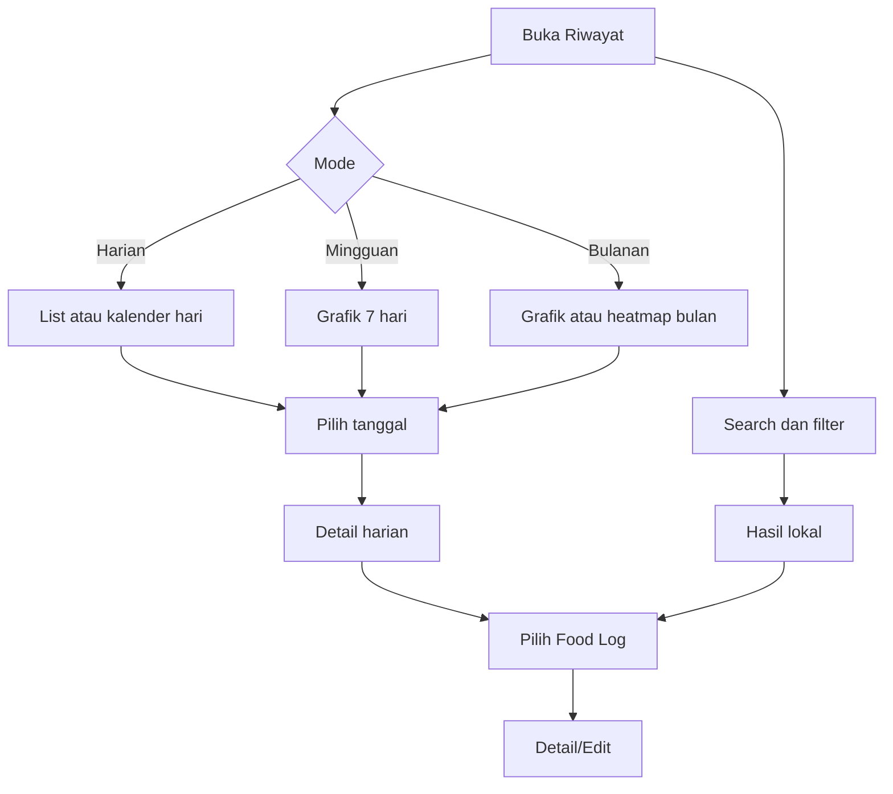
```mermaid
flowchart TD
    A[Buka Riwayat] --> B{Mode}
    B -- Harian --> C[List atau kalender hari]
    B -- Mingguan --> D[Grafik 7 hari]
    B -- Bulanan --> E[Grafik atau heatmap bulan]
    C --> F[Pilih tanggal]
    D --> F
    E --> F
    F --> G[Detail harian]
    G --> H[Pilih Food Log]
    H --> I[Detail/Edit]
    A --> J[Search dan filter]
    J --> K[Hasil lokal]
    K --> H
```

---

## 12. Flow I — Target Kalori dan BMR/TDEE

### 12.1 Mengubah Target Manual

1. `Pengaturan > Target dan Profil`.
2. Tampilkan target aktif dan source.
3. Tekan **Ubah Target**.
4. Masukkan kcal.
5. Pilih effective date:
   - hari ini;
   - besok;
   - tanggal tertentu.
6. Validasi.
7. Jika ekstrem, tampilkan konfirmasi.
8. Simpan sebagai histori target baru.
9. Dashboard periode terdampak diperbarui.
10. Reminder direkonsiliasi.

### 12.2 Menghitung Ulang BMR/TDEE

1. Tekan **Hitung Estimasi**.
2. Isi/perbarui data.
3. Lihat hasil:
   - BMR;
   - activity factor;
   - TDEE;
   - goal adjustment;
   - suggested target sebagai estimasi.
4. Actions:
   - Terapkan;
   - Ubah Manual;
   - Batal.
5. Terapkan menghasilkan histori target source `tdee`.
6. Data profil tetap lokal dan tidak dikirim ke Gemini.

### 12.3 Target Makro

Jika fitur diaktifkan:

1. Pilih “Atur target makro”.
2. Mode:
   - gram;
   - persentase kalori.
3. Aplikasi mengonversi dan menampilkan summary.
4. Pengguna mengonfirmasi.
5. Dashboard macro progress diperbarui.

### 12.4 Mermaid

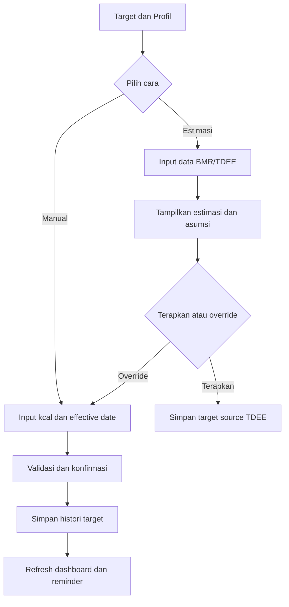
```mermaid
flowchart TD
    A[Target dan Profil] --> B{Pilih cara}
    B -- Manual --> C[Input kcal dan effective date]
    B -- Estimasi --> D[Input data BMR/TDEE]
    D --> E[Tampilkan estimasi dan asumsi]
    E --> F{Terapkan atau override}
    F -- Terapkan --> G[Simpan target source TDEE]
    F -- Override --> C
    C --> H[Validasi dan konfirmasi]
    H --> I[Simpan histori target]
    I --> J[Refresh dashboard dan reminder]
```

---

## 13. Flow J — Pengaturan Reminder

### 13.1 Mengaktifkan

1. `Pengaturan > Reminder`.
2. Toggle aktif.
3. Jika permission belum diberikan:
   - tampilkan pre-permission explanation;
   - tekan **Izinkan Notifikasi**;
   - system prompt muncul.
4. Jika granted:
   - tampilkan jadwal.
5. Jika denied:
   - tampilkan petunjuk membuka Settings OS;
   - toggle app dapat tetap off/pending.

### 13.2 Mengatur Preferensi

Pengguna memilih:

- jam reminder;
- threshold progress;
- hari aktif;
- quiet hours opsional.

Contoh:

```text
Jam: 20:00
Kirim jika progress < 70%
Hari: Senin–Minggu
```

### 13.3 Reconcile Schedule

Setelah simpan:

1. Aplikasi menghitung horizon tanggal.
2. Jadwalkan candidate notifications.
3. Untuk hari ini:
   - jika waktu belum lewat dan progress < threshold → schedule;
   - jika progress ≥ threshold → cancel;
   - jika waktu sudah lewat → tidak schedule retroaktif.
4. Setelah Food Log berubah:
   - hitung progress ulang;
   - cancel atau maintain notifikasi.
5. Perubahan target memicu kalkulasi ulang.

### 13.4 Menonaktifkan

1. Toggle off.
2. Batalkan seluruh pending KeySpace reminders.
3. Simpan preference.
4. Tidak mengubah Food Log.

### 13.5 Mermaid

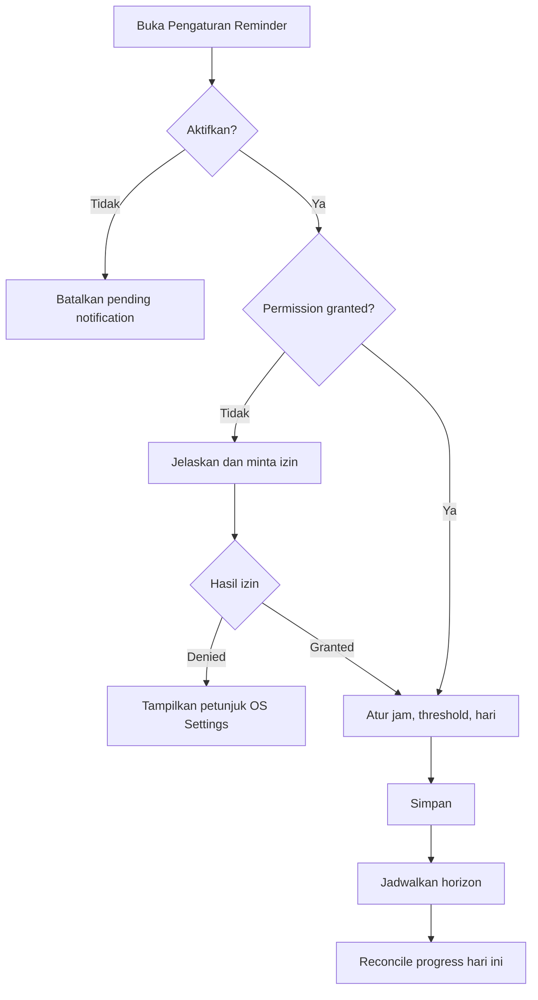
```mermaid
flowchart TD
    A[Buka Pengaturan Reminder] --> B{Aktifkan?}
    B -- Tidak --> C[Batalkan pending notification]
    B -- Ya --> D{Permission granted?}
    D -- Tidak --> E[Jelaskan dan minta izin]
    E --> F{Hasil izin}
    F -- Denied --> G[Tampilkan petunjuk OS Settings]
    F -- Granted --> H[Atur jam, threshold, hari]
    D -- Ya --> H
    H --> I[Simpan]
    I --> J[Jadwalkan horizon]
    J --> K[Reconcile progress hari ini]
```

---

## 14. Flow K — Menerima dan Menindaklanjuti Notifikasi

### 14.1 Notification Received

Notifikasi muncul jika candidate notification belum dibatalkan.

Contoh copy:

> Asupan hari ini masih di bawah target yang kamu tetapkan. Buka KeySpace untuk meninjau atau mencatat makanan.

### 14.2 User Taps Notification

1. OS membuka KeySpace.
2. Payload berisi `local_date`.
3. App bootstrap.
4. Buka Dashboard tanggal terkait.
5. Tampilkan contextual card:
   - progress;
   - CTA Catat Makanan;
   - CTA Abaikan/Tutup.

### 14.3 Quick Action

Jika platform/plugin mendukung actions:

- **Catat Makanan** → buka Chat untuk tanggal tersebut.
- **Buka Dashboard** → detail tanggal.

### 14.4 Jika Target Sudah Tercapai tetapi Notifikasi Tetap Terkirim

Kasus dapat terjadi akibat delay/race OS.

1. Saat app dibuka, aplikasi membaca data terbaru.
2. Jika progress sudah mencapai threshold:
   - jangan tampilkan pesan “masih kurang” di dalam app;
   - tampilkan dashboard normal;
   - diagnostics dapat mencatat notification race.
3. Reconcile jadwal berikutnya.

### 14.5 Mermaid

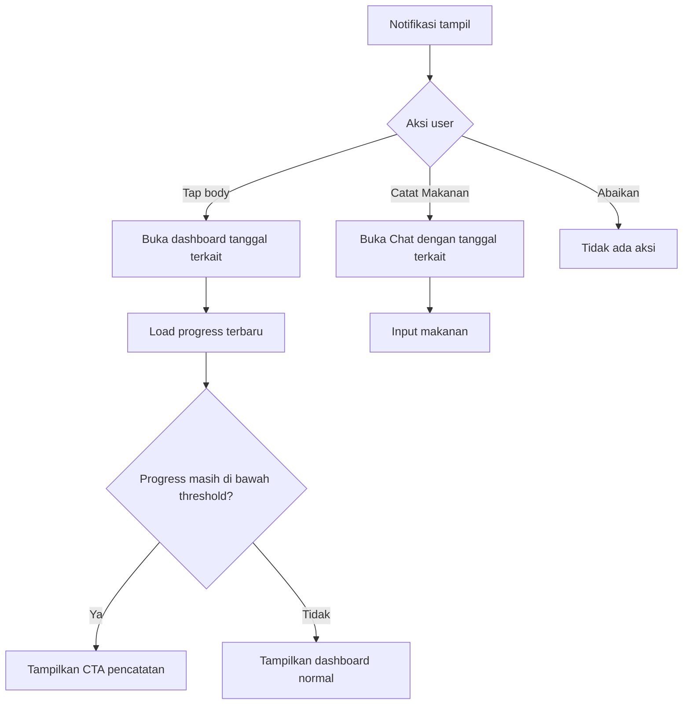
```mermaid
flowchart TD
    A[Notifikasi tampil] --> B{Aksi user}
    B -- Tap body --> C[Buka dashboard tanggal terkait]
    B -- Catat Makanan --> D[Buka Chat dengan tanggal terkait]
    B -- Abaikan --> E[Tidak ada aksi]
    C --> F[Load progress terbaru]
    D --> G[Input makanan]
    F --> H{Progress masih di bawah threshold?}
    H -- Ya --> I[Tampilkan CTA pencatatan]
    H -- Tidak --> J[Tampilkan dashboard normal]
```

---

## 15. Flow L — Manual Entry

### 15.1 Entry Points

- Dashboard > Manual.
- Chat error > Catat Manual.
- All-keys-failed > Catat Manual.
- Offline state.
- Quick Add > Edit before save.

### 15.2 Step-by-Step

1. Form membuat Food Log draft.
2. Prefill:
   - tanggal/waktu;
   - meal type;
   - original chat text sebagai notes bila berasal dari chat.
3. Pengguna menambah satu atau beberapa item.
4. Per item:
   - nama required;
   - kalori required;
   - makro optional;
   - porsi optional.
5. Total dihitung real-time.
6. Pengguna menekan Simpan.
7. Database transaction.
8. Dashboard dan reminder diperbarui.
9. Jika berasal dari failed chat:
   - assistant/system message mencatat bahwa entry diselesaikan manual;
   - failed input tetap dapat dipertahankan atau ditandai resolved.

---

## 16. Flow M — Favorite dan Quick Add

### 16.1 Menyimpan Favorite

1. Dari Food Log atau Food Item, buka menu.
2. Pilih **Simpan sebagai Favorit**.
3. Beri nama template.
4. Pilih item yang disertakan.
5. Simpan lokal.

### 16.2 Menggunakan Quick Add

1. Dashboard > Quick Add.
2. Tampilkan:
   - Favorites;
   - Frequently Eaten;
   - Recent.
3. Pilih item/template.
4. Pilih porsi atau edit.
5. Tentukan waktu/meal type.
6. Simpan.
7. Usage count diperbarui.

### 16.3 Mengelola Favorite

1. Buka daftar Favorites.
2. Rename, edit template, atau delete.
3. Delete tidak menghapus Food Log historis.

---

## 17. Flow N — Export dan Backup

### 17.1 Export CSV

1. `Pengaturan > Data > Export CSV`.
2. Pilih:
   - date range;
   - Food Log only atau detail item.
3. Tampilkan informasi:
   - API key tidak disertakan.
4. Tekan Export.
5. Generate file lokal.
6. Buka share/save sheet.
7. Hapus temporary file sesuai lifecycle.

### 17.2 Backup JSON

1. Pilih **Buat Backup**.
2. Aplikasi menampilkan cakupan data.
3. API key secret dikecualikan.
4. Generate versioned JSON.
5. Pengguna memilih lokasi.
6. Tampilkan timestamp backup terakhir secara lokal.

### 17.3 Mermaid

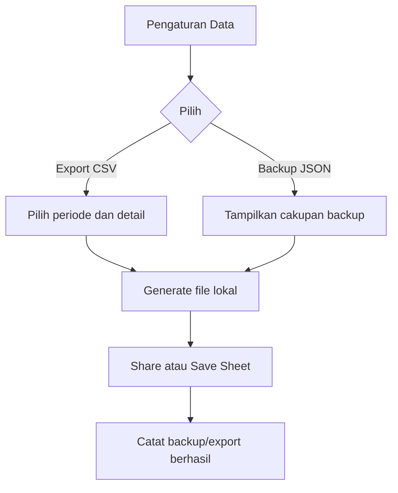
```mermaid
flowchart TD
    A[Pengaturan Data] --> B{Pilih}
    B -- Export CSV --> C[Pilih periode dan detail]
    B -- Backup JSON --> D[Tampilkan cakupan backup]
    C --> E[Generate file lokal]
    D --> E
    E --> F[Share atau Save Sheet]
    F --> G[Catat backup/export berhasil]
```

---

## 18. Flow O — Restore Data

### 18.1 Step-by-Step

1. `Pengaturan > Data > Restore`.
2. Tampilkan warning:
   - backup tidak memulihkan API key;
   - buat backup saat ini sebelum replace.
3. User memilih file.
4. Aplikasi membaca file di memory/temporary storage.
5. Validasi:
   - format;
   - schema version;
   - checksum bila tersedia;
   - required fields;
   - ukuran file.
6. Jika invalid:
   - tampilkan alasan aman;
   - tidak ada perubahan database.
7. Jika valid:
   - tampilkan preview:
     - jumlah Food Log;
     - Food Item;
     - chat;
     - target;
     - settings;
     - date range.
8. Pilih mode:
   - Merge;
   - Replace.
9. Untuk Replace:
   - tawarkan safety backup;
   - konfirmasi teks.
10. Jalankan transaction/migration.
11. Tampilkan report:
   - imported;
   - skipped duplicate;
   - failed.
12. Rebuild indexes/cache.
13. Reschedule reminders.
14. Tampilkan CTA:
   - Tambahkan API Key;
   - Kembali ke Dashboard.

### 18.2 Mermaid

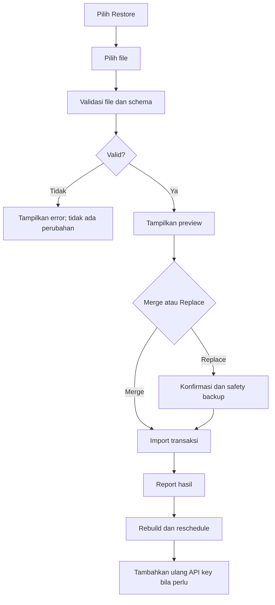
```mermaid
flowchart TD
    A[Pilih Restore] --> B[Pilih file]
    B --> C[Validasi file dan schema]
    C --> D{Valid?}
    D -- Tidak --> E[Tampilkan error; tidak ada perubahan]
    D -- Ya --> F[Tampilkan preview]
    F --> G{Merge atau Replace}
    G -- Merge --> H[Import transaksi]
    G -- Replace --> I[Konfirmasi dan safety backup]
    I --> H
    H --> J[Report hasil]
    J --> K[Rebuild dan reschedule]
    K --> L[Tambahkan ulang API key bila perlu]
```

---

## 19. Flow P — Menghapus Semua Data

1. `Pengaturan > Data > Hapus Semua Data`.
2. Tampilkan penjelasan:
   - Food Log, chat, target, settings, API key, dan reminder akan dihapus;
   - tindakan tidak dapat dibatalkan tanpa backup.
3. Tawarkan **Buat Backup Dulu**.
4. Pengguna melanjutkan.
5. Konfirmasi kedua, misalnya memasukkan kata `HAPUS`.
6. Aplikasi:
   - membatalkan notifications;
   - menghapus secure storage entries;
   - menghapus database/cache;
   - reset onboarding.
7. Kembali ke Welcome.
8. Tidak ada request ke server.

---

## 20. Flow Q — Undo Setelah Menghapus Food Log

### 20.1 Step-by-Step

1. User menekan Hapus pada Food Log (dari Hari Ini, Riwayat, atau Edit).
2. Aplikasi menandai `deleted_at` (bukan hard delete) dan langsung mengeluarkan item dari agregasi kalori/makro yang tampil.
3. Snackbar/undo bar muncul: “Food Log dihapus” dengan tombol **Urungkan**.
4. Jika user menekan **Urungkan** sebelum window berakhir:
   - `deleted_at` dikosongkan kembali;
   - item dan agregasinya muncul lagi persis seperti sebelumnya;
   - snackbar hilang.
5. Jika window berakhir tanpa aksi:
   - snackbar hilang;
   - item tetap bertanda `deleted_at` dan menunggu proses hard delete permanen di background (atau saat maintenance berikutnya);
   - tidak ada jalur pemulihan lain selain restore dari backup setelah titik ini.
6. Jika user menghapus Food Log lain sebelum window sebelumnya berakhir:
   - setiap penghapusan punya window undo independen;
   - snackbar terbaru yang ditampilkan ke user, tidak menggantikan status undo item sebelumnya.

### 20.2 Mermaid

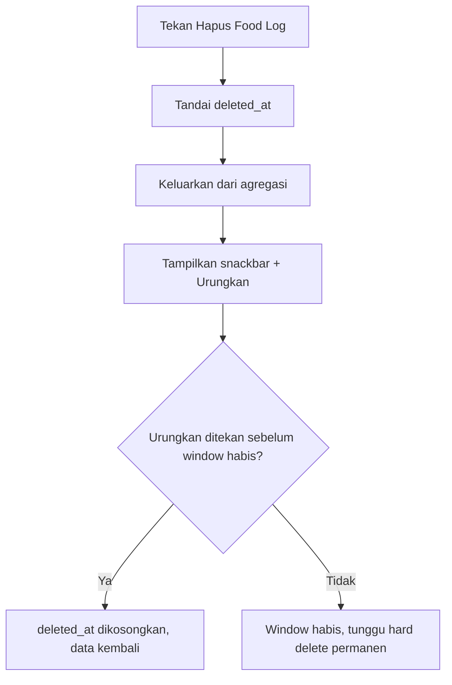
```mermaid
flowchart TD
    A[Tekan Hapus Food Log] --> B[Tandai deleted_at]
    B --> C[Keluarkan dari agregasi]
    C --> D[Tampilkan snackbar + Urungkan]
    D --> E{Urungkan ditekan sebelum window habis?}
    E -- Ya --> F[deleted_at dikosongkan, data kembali]
    E -- Tidak --> G[Window habis, tunggu hard delete permanen]
```

---

## 21. Flow R — App Lock (PIN/Biometric)

### 21.1 Setup App Lock dari Pengaturan

1. `Pengaturan > App Lock`.
2. User mengaktifkan toggle App Lock.
3. User membuat PIN (masukkan dua kali untuk konfirmasi).
4. Jika perangkat mendukung biometrik, tampilkan opsi **Aktifkan Biometrik** sebagai tambahan di atas PIN.
5. User memilih mode pemicu: **Setiap Buka Aplikasi** atau **Setelah Idle [durasi]**.
6. Simpan PIN hash tersalting ke secure storage; simpan preferensi mode ke database biasa (non-secret).
7. Konfirmasi: “App Lock aktif.”

### 21.2 Autentikasi Saat Aplikasi Dibuka/Resume

1. Aplikasi terdeteksi perlu lock sesuai mode Flow A §4.5a.
2. Jika biometrik aktif: tampilkan prompt biometrik native OS terlebih dahulu.
3. Jika biometrik gagal/dibatalkan/tidak tersedia: tampilkan input PIN sebagai fallback.
4. PIN salah berkali-kali memicu throttling (jeda bertambah), bukan penghapusan data.
5. Autentikasi berhasil → lanjut ke layar tujuan (Dashboard atau layar terakhir yang relevan).

### 21.3 Menonaktifkan atau Reset PIN

1. `Pengaturan > App Lock > Nonaktifkan` meminta autentikasi ulang (PIN/biometrik) sebelum toggle bisa dimatikan.
2. `Ubah PIN` meminta PIN lama, lalu PIN baru dua kali.
3. Jika user lupa PIN dan biometrik tidak tersedia/gagal:
   - tampilkan opsi **Reset PIN**;
   - reset PIN tidak menghapus data Food Log/API key;
   - reset dilakukan melalui konfirmasi tambahan lokal (misalnya jeda waktu/re-entry info dasar), didetailkan saat implementasi;
   - setelah reset, App Lock otomatis nonaktif dan user dapat mengaktifkan kembali dengan PIN baru.

### 21.4 Mermaid

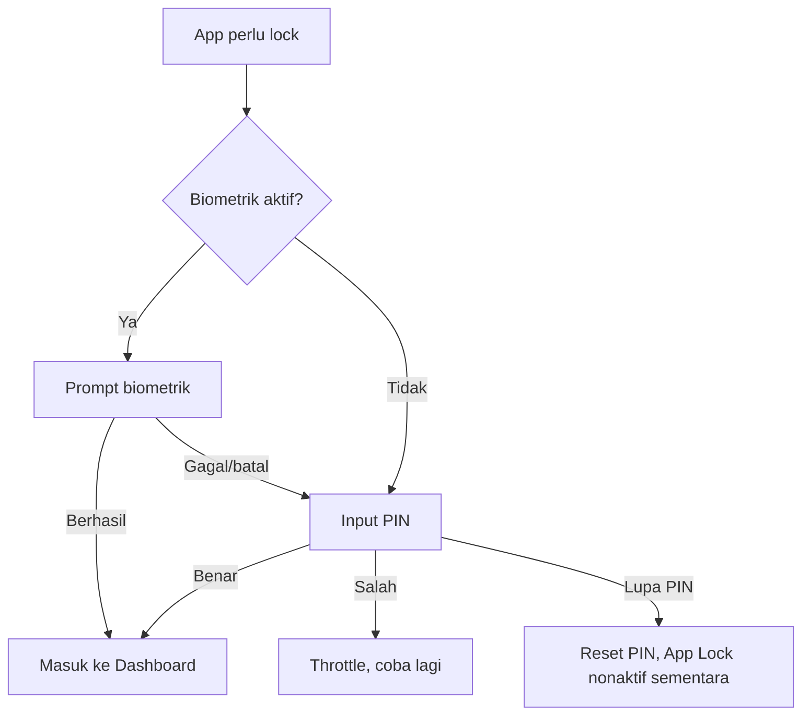
```mermaid
flowchart TD
    A[App perlu lock] --> B{Biometrik aktif?}
    B -- Ya --> C[Prompt biometrik]
    C -- Berhasil --> F[Masuk ke Dashboard]
    C -- Gagal/batal --> D[Input PIN]
    B -- Tidak --> D
    D -- Benar --> F
    D -- Salah --> E[Throttle, coba lagi]
    D -- Lupa PIN --> G[Reset PIN, App Lock nonaktif sementara]
```

---

## 22. Flow S — Widget Home Screen (Fase 3)

### 22.1 Step-by-Step

1. User menambahkan widget KeySpace ke home screen perangkat (mekanisme native OS, di luar aplikasi).
2. Widget membaca ringkasan kalori `Current Local Date` langsung dari database lokal (tanpa memanggil Gemini API).
3. Widget menampilkan: total kalori dikonsumsi, Daily Target, dan sisa kalori — format ringkas mengikuti §5.5 pada design.md.
4. User menekan tombol Quick Add pada widget:
   - jika App Lock nonaktif, aplikasi terbuka langsung ke layar Chat/Manual Entry;
   - jika App Lock aktif, aplikasi terbuka ke Layar Lock terlebih dahulu, lalu diarahkan ke Chat/Manual Entry setelah autentikasi berhasil.
5. Widget memperbarui tampilannya setiap ada perubahan Food Log/target yang relevan dengan `Current Local Date`, dan saat OS melakukan refresh widget berkala.
6. Ketika offline, widget tetap menampilkan data lokal terakhir tanpa indikator error, karena tidak ada dependensi jaringan untuk menampilkan ringkasan ini.

### 22.2 Mermaid

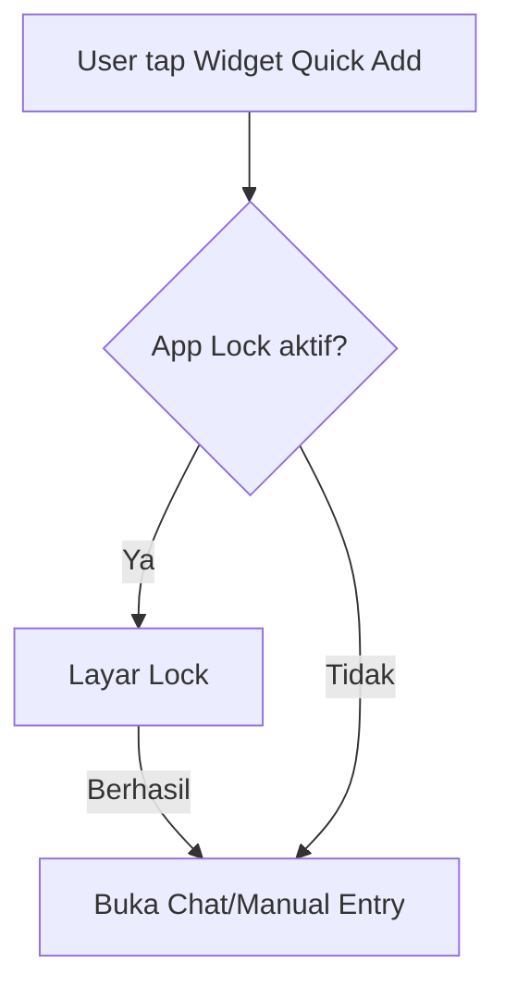
```mermaid
flowchart TD
    A[User tap Widget Quick Add] --> B{App Lock aktif?}
    B -- Ya --> C[Layar Lock]
    C -- Berhasil --> D[Buka Chat/Manual Entry]
    B -- Tidak --> D
```

---

## 23. Error and Empty State Matrix

| Situasi | Pesan Utama | Primary Action | Secondary |
|---|---|---|---|
| Tidak ada key | AI memerlukan API key milikmu | Tambah API Key | Catat Manual |
| Satu key gagal, key lain dicoba | Mencoba koneksi alternatif… | Tidak perlu interaksi | Batal |
| Semua key gagal | Semua API key tidak dapat digunakan | Tambah API Key Baru | Kelola, Retry, Manual |
| Offline | Tidak ada koneksi internet | Coba Lagi | Catat Manual |
| Response tidak valid | Hasil belum dapat diproses | Coba Lagi | Ubah Input, Manual |
| Safety block | Input ini belum dapat diproses | Ubah Input | Manual |
| Database error | Data lokal belum dapat dibuka | Coba Lagi | Restore, Diagnostics |
| Secure storage error | API key tidak dapat dibaca | Tambah/Uji Key | Manual |
| Empty dashboard | Belum ada makanan dicatat | Catat Makanan | Quick Add |
| Empty history | Belum ada data pada periode ini | Catat Makanan | Pilih Periode |
| Notification denied | Izin notifikasi belum diberikan | Buka Pengaturan | Nanti |
| Restore invalid | File backup tidak valid/didukung | Pilih File Lain | Batal |
| PIN salah berkali-kali | Terlalu banyak percobaan, coba lagi nanti | Tunggu Jeda | Gunakan Biometrik |
| Lupa PIN, biometrik tidak tersedia | PIN tidak dikenali | Reset PIN | Batal |
| Widget tanpa data (belum pernah buka app) | Belum ada data untuk hari ini | Buka Aplikasi | — |

---

## 24. Deep Link dan Navigation Payload

### 21.1 Notification Payload

```json
{
  "type": "calorie_reminder",
  "local_date": "2026-07-21"
}
```

### 21.2 Internal Route Examples

```text
/home?date=2026-07-21
/chat?date=2026-07-21&source=reminder
/settings/api-keys?returnTo=pendingRequest
/food-log/<id>/edit
```

### 21.3 Return-to-Pending-Request Rule

Ketika Add Key dibuka dari all-keys-failed:

1. Simpan `pending_request_id`.
2. Setelah Add Key selesai, jangan kembali ke root settings.
3. Kembali ke Chat request terkait.
4. Tampilkan:
   - Lanjutkan Pencatatan;
   - Edit Input;
   - Catat Manual.
5. Jangan mengirim otomatis tanpa tindakan user jika penambahan key berpotensi memakai quota/biaya, kecuali user sebelumnya telah memilih “Coba otomatis setelah key tersimpan.”

Baseline yang lebih aman: user menekan **Lanjutkan Pencatatan**.

---

## 25. Accessibility dan UX Behavior

1. Loading state harus diumumkan ke screen reader.
2. Status key tidak boleh bergantung pada warna; tampilkan label dan icon.
3. Masked key tidak dibacakan sebagai secret.
4. Dialog all-keys-failed harus fokus ke judul lalu primary action.
5. Progress ring harus memiliki text equivalent:
   - “640 dari 2.000 kilokalori.”
6. Grafik harus memiliki summary text.
7. Error field harus terhubung dengan input.
8. Touch target mengikuti minimum platform.
9. Dynamic text tidak boleh memotong primary actions.
10. Haptic feedback bersifat opsional dan mengikuti setting.

---

## 26. Analytics Lokal untuk Evaluasi Produk

Tanpa mengirim data ke developer, aplikasi dapat menyimpan counter lokal opsional:

- jumlah Food Parsing Request;
- jumlah success;
- jumlah failover;
- jumlah all-keys-failed;
- jumlah manual fallback;
- median latency lokal;
- jumlah koreksi sebelum save;
- jumlah backup.

Counter:

- tidak menyimpan isi makanan;
- tidak menyimpan API key;
- tidak dikirim otomatis;
- dapat diekspor secara sukarela untuk beta feedback;
- dapat dihapus pengguna.

---

## 27. Acceptance Scenarios Kritis

### UF-AC-01 — Onboarding Tanpa Key

**Given** instalasi baru dan offline  
**When** user mengisi target manual dan melewati API key  
**Then** onboarding selesai dan Dashboard dapat digunakan.

### UF-AC-02 — Chat dengan Key Sehat

**Given** satu key healthy  
**When** user mengirim deskripsi makanan  
**Then** preview muncul dan dapat disimpan.

### UF-AC-03 — Failover Satu Key

**Given** Key A active gagal 429 dan Key B healthy  
**When** user mengirim input  
**Then** KeySpace menandai A limited, mencoba B, menampilkan preview, dan menjadikan B Active Key.

### UF-AC-04 — Semua Key Gagal

**Given** seluruh key invalid/limited/error  
**When** user mengirim input  
**Then** input tetap tersimpan dan dialog menampilkan **Tambah API Key Baru**, Kelola, Coba Lagi, dan Catat Manual.

### UF-AC-05 — Tambah Key dari All-Keys-Failed

**Given** request tertunda karena seluruh key gagal  
**When** user menambahkan key baru  
**Then** user kembali ke request yang sama dan dapat menekan **Lanjutkan Pencatatan** tanpa mengetik ulang.

### UF-AC-06 — Offline Tidak Menghabiskan Pool

**Given** perangkat offline dan beberapa key tersedia  
**When** user mengirim input  
**Then** aplikasi berhenti pada offline state tanpa menandai seluruh key gagal.

### UF-AC-07 — Edit Mengubah Reminder

**Given** reminder hari ini terjadwal dan progress 60%  
**When** user mengedit log sehingga progress menjadi 75% dengan threshold 70%  
**Then** notifikasi hari ini dibatalkan.

### UF-AC-08 — Backup Tanpa Key

**Given** pengguna memiliki beberapa API key  
**When** membuat backup JSON  
**Then** file tidak mengandung secret atau secure reference yang dapat digunakan ulang.

### UF-AC-09 — Restore

**Given** backup valid  
**When** user memilih merge  
**Then** data diimpor secara transaksi, duplicate dilaporkan, dan key perlu ditambahkan ulang.

### UF-AC-10 — Hapus Semua Data

**Given** data, API key, dan notification pending  
**When** user menyelesaikan konfirmasi hapus  
**Then** database, secure storage KeySpace, cache, dan notification dihapus, lalu onboarding ditampilkan.

### UF-AC-11 — Undo Hapus Food Log

**Given** Food Log baru saja dihapus dan window undo masih berjalan  
**When** user menekan Urungkan  
**Then** Food Log dan agregasi kalorinya kembali persis seperti sebelum dihapus.

### UF-AC-12 — App Lock Menghalangi Konten Sebelum Autentikasi

**Given** App Lock aktif dan aplikasi baru dibuka dari kondisi tertutup  
**When** aplikasi mulai berjalan  
**Then** Dashboard tidak dirender di belakang Layar Lock sampai autentikasi (biometrik atau PIN) berhasil.

### UF-AC-13 — Widget Tetap Tampil Saat Offline

**Given** perangkat offline dan widget sudah pernah menampilkan data sebelumnya  
**When** user melihat home screen  
**Then** widget tetap menampilkan ringkasan kalori terakhir yang valid tanpa error, karena widget tidak bergantung pada koneksi internet.

---

## 28. Ringkasan Alur Utama

```text
Install
  -> Onboarding tanpa login
  -> Set target manual atau estimasi
  -> Tambah API key atau lewati
  -> Dashboard

Catat melalui Chat
  -> Simpan input lokal
  -> Gunakan Active Key
  -> Jika gagal: key berikutnya
  -> Jika sukses: preview -> edit -> simpan
  -> Jika semua gagal: tambah key baru / kelola / retry / manual
  -> Input tidak hilang

Gunakan Offline
  -> Dashboard/history/edit/manual tetap tersedia
  -> Chat menunggu internet atau dialihkan ke manual

Kelola Data
  -> Export/backup lokal
  -> Restore merge/replace
  -> API key tidak masuk backup default
```

Keputusan UX yang wajib dipertahankan pada seluruh desain dan implementasi adalah: **failover berlangsung otomatis untuk kegagalan key-specific; ketika seluruh key gagal, pengguna mendapat peringatan yang jelas dan diarahkan menambahkan API key baru, sementara input pencatatan tetap tersimpan.**
